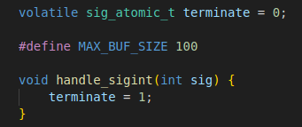

# [BD2]Practica1_G27

## Descripcion 
___
### Practica
[Enunciado de la Practica](./Img/Enunciado%20Practica%201.pdf)

### Indicaciones Basicas :nerd_face:
    * Se utilizo linux mint version 21.2
    * Se instalaron los siguientes paquetes
        - https://community.linuxmint.com/software/view/build-essential
        - https://community.linuxmint.com/software/view/gdb
        - https://community.linuxmint.com/software/view/systemtap
    * Se instalo el visual studio con los paquetes de c/c++ de Microsoft

### Comandos utilizados en C:
```javascript
// Comandos para C
// Para compilar los archivos de C
gcc child.c -o child.bin
gcc child2.c -o child2.bin
gcc parent.c -o parent

// Para Ejecutar el programa 
./parent

// Comando para ver el el numero de proceso de ejecutandose
ps -A | grep firefox

// Para ejecutar el Stapsytem
sudo stap trace.stp <<PID1>> 

// Para ejecutar el Stapsytem y sacar el contenido en el archivo syscalls.log
sudo stap trace.stp <<PID1>>  >> /tmp/practica/syscalls.log
```

### Explicacion basico del codigo

## Archivo parent.c

1. #### Rutas de los archivos creados


2. #### Verificacion de rutas existentes


3. #### Creacion de archivos


4. #### Creacion de procesos hijos o hilos hijos


5. #### Llamado del proceso hijo no. 1


6. #### Llamado del proceso hijo no. 2


7. #### Creacion de SIGNIT (ctrl +c)



8. #### Comprobacion de terminado de procesos


## Archivo child.c

9. #### Generacion de datos alfanumericos


10. #### Funcion de write


11. #### Funcion de read


12. #### Funcion de wait


13. #### Ciclo con las funciones implementadas


## Como funciona el programa

14. #### Creacion de archivos bin y compilado y ejecucion


15. #### Salida del programa


16. #### Archivos creados


17. #### Archivo de practica1.txt


18. #### Archvio de syscalls.log


___
### Integrantes
| Nombre | Carnet | Usuario Git |
|----------|----------|----------|
| Henrry David Bran Velasquez | 201314439 | [Henrry Bran](https://github.com/HenrryBran-Hub) |
| Henry Gabriel Peralta Martinez  | 201712289 | [Henry Peralta](https://github.com/HenryPeralta) |
___

