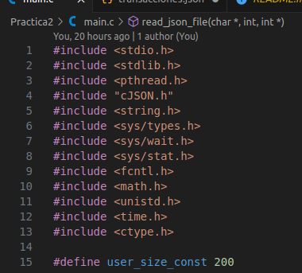

# [BD2]Practica2_G27

## Descripcion 
___
### Practica
[Enunciado de la Practica](./Img/Enunciado%20Practica%202%20-%20Junio.pdf)


### Comandos utilizados en C:
```javascript
// Comandos para C
// Para compilar los archivos de C
gcc main.c cJSON.c -o main -lm

// Para Ejecutar el programa 
./main
```

### Explicacion basico del codigo

## Archivo main.c

1. #### Rutas de los archivos creados




___
### Integrantes
| Nombre | Carnet | Usuario Git |
|----------|----------|----------|
| Henrry David Bran Velasquez | 201314439 | [Henrry Bran](https://github.com/HenrryBran-Hub) |
| Henry Gabriel Peralta Martinez  | 201712289 | [Henry Peralta](https://github.com/HenryPeralta) |
___

