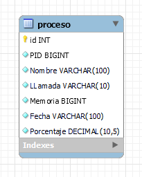
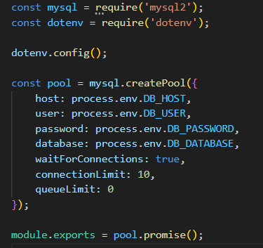

# [BD2]Practica2_G27

## Descripcion 
___
### Practica
[Enunciado de la Practica](./Img/SO2_Proyecto.pdf)


### Comandos utilizados en C:
```javascript
// Comandos para C

// Libreria necesaria
sudo apt-get install libmysqlclient-dev

// Para compilar los archivos de C
gcc main.c -o main -lmysqlclient

// Para Ejecutar el programa 
sudo ./main

// paquetes instalados para node js
npm init -y 
npm install express dotenv mysql2 cores morgan

// paquetes instalados para react
npm install react-router-dom
npm install chart.js react-chart.js-2
npm install bootstrap

// para ejecutar las aplicaciones
// node
npm start

// react 
npm start
```

# Explicación basica del codigo

## Arquitectura


## Base de datos

### Base de datos sopes2 y tabla proces


### Procedure GetTopMemoryProcesses()
- Este proceso calcula el total de memoria para calcular los porcentajes
- Crea una tabla temporal para almacenar los resultados 
- Inserta los top 9 procesos agrupados por PID
- Nombra en la tabla temporal e inserta la suma de memoria y porcentaje de los procesos restantes bajo "Otros".


### Procedure ConvertirMemoriaToMB(), este proceso convierte la memoria a MB


### Modelo entidad relacion



## Backend

### Modelo para la conexion a la base de datos



### Servidor Node, se configuro el servidor node en el puerto 5000 y este se conecta con BD


### Api end point para obtener los datos de la BD


## Front

### Index.html


### App.js


### NavBar.js


### HistoryMonitor.js


### HomePage.js


### RealTimeMonitor.js


## C

### Estructura para almacenar los datos procesados


### Variables globales para controlar la ejecución del programa


### Función para obtener la memoria total del sistema


### Función para leer y procesar el archivo de registro e insertar en la base de datos


### funcion main()
- Contiene el Manejo de la señal SIGINT (Ctrl+C)
- Crea o trunca el archivo syscalls.log
- Inicializa la conexión MySQL
- Tiene los datos de conexión
- Conecta a la base de datos e Inicia el comando para capturar los registros


# Funcionamiento del programa

### Inicio del programa


### Grafica y top de procesos


### Tabla de procesos


___
### Integrantes
| Nombre | Carnet | Usuario Git |
|----------|----------|----------|
| Henrry David Bran Velasquez | 201314439 | [Henrry Bran](https://github.com/HenrryBran-Hub) |
| Henry Gabriel Peralta Martinez  | 201712289 | [Henry Peralta](https://github.com/HenryPeralta) |
___
